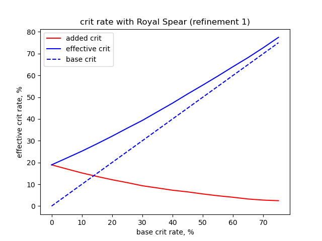
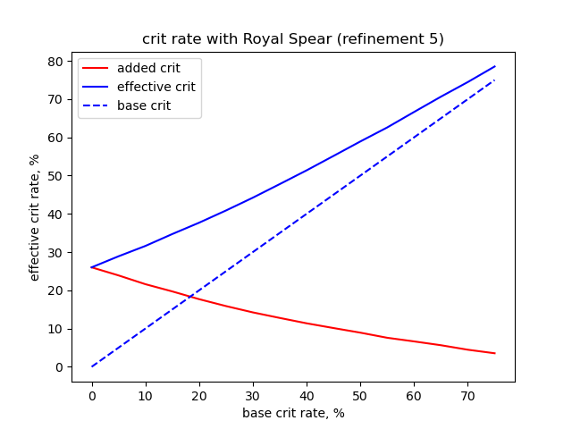
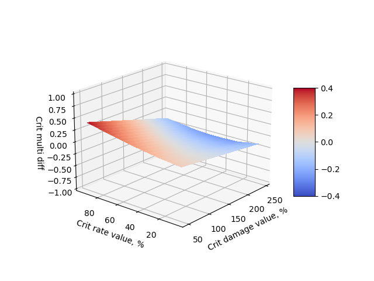
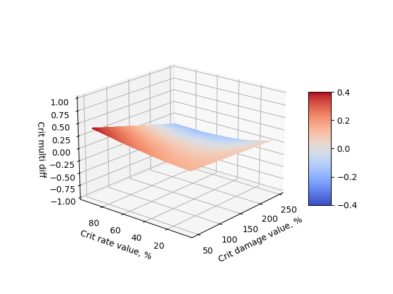

# Average added crit rate when using Royal Weapons

Simple snippet that simulates hits with [Royal Spear](https://genshin-impact.fandom.com/wiki/Royal_Spear). But it is same for every other weapon from "Royal" set.

Calcualtions were done with different base crit values.

## Result for R1 weapon

## Result for R5 weapon

# Dropping crit rate with Royal weapon
Also calculated expected crit multiplier difference between two setups:
- any atk% weapon + crit rate head artifact(26% crit rate)
- Royal weapon + crit damage head artifact(57% crit damage)

Red = setup with Royal is better. On Z axis difference in crit multiplier is noted.

## Result for R1 weapon

## Result for R5 weapon

